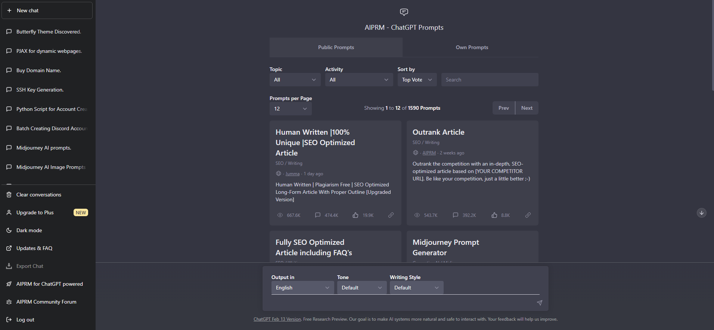

## [AIPRM for ChatGPT](https://www.aiprm.com/)
- This extension adds a list of curated prompt templates for you to ChatGPT.
- You can create your own prompt template and uploads too!

#### How to use:
1. Open chrome and download from [here](https://chrome.google.com/webstore/detail/aiprm-for-chatgpt/ojnbohmppadfgpejeebfnmnknjdlckgj).

2. Visit ChatGPT. This is your new UI.

3. Select a prompt through `Topic`, `Activity`, or `search` for keywords!

4. After you select a template, it will provide you a hint to your prompt.

5. Explore and enjoy!

> You might encounter chat history missing after AIPRM installed, just logout and login will solve.

> To be continue...
